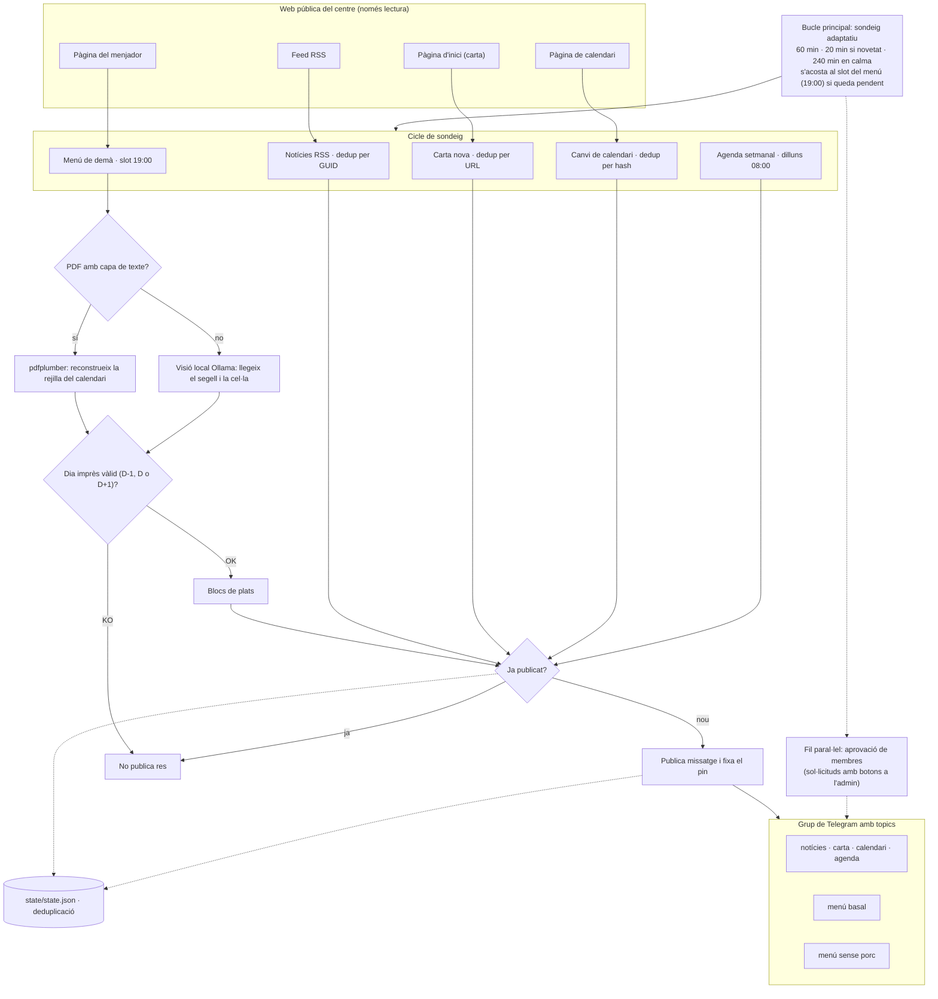

# avisos-afa-telegram

Servei d'avisos per a **AFAs** (associacions de famílies d'alumnat): recull el
contingut que el centre ja publica a la seva web pública (carta mensual,
calendari i notícies) i el reenvia com a **avisos + enllaç** a un grup de
Telegram, perquè les famílies no hagin de revisar la web a mà.

> Desplegament de referència: **AFA de l'Escola Elisa Badia** (Barberà del
> Vallès). El programari és genèric i reutilitzable per altres associacions.

> **Documentació:**
> - [Com funciona i quines dades toca (transparència)](docs/transparencia.md)
> - [Per què Telegram i no WhatsApp](docs/transparencia.md#per-què-telegram-i-no-whatsapp)
> - [Guia: crear el bot i el grup de Telegram](docs/guia-telegram.md)
> - [Visió i evolució del projecte](docs/features-roadmap.md)
> - [Planificació del projecte (OpenSpec)](openspec/changes/afa-elisabadia-avisos/proposal.md)

## Característiques

- Sondeig de la web pública del centre: RSS, enllaç de la carta del mes i
  pàgina de calendari.
- Publicació d'**avís + enllaç** (sense resums ni IA en la fase actual), en
  l'idioma configurat (per defecte, català).
- **Sondeig adaptatiu**: més freqüent si hi ha novetat, més espaiat en calma.
- **Un sol grup de Telegram amb topics**; el filtre per curs es fa silenciant
  topics (sense registre de famílies).
- **Agenda de la carta**: extreu la taula d'activitats (Dia | Curs | Activitat)
  del PDF i publica la selecció del curs en sortir carta nova, més una agenda
  setmanal programada.
- **Menú del menjador diari**: publica el menú de demà el dia anterior a les
  19:00 als topics de cada variant (basal / sense porc), amb salt de dies no
  lectius i un missatge fixat amb l'enllaç al PDF vigent. Quan el PDF del mes
  no té capa de texte (imatge pura), es transcriu amb **visió local i privada**
  (Ollama, sense dades fora del servidor) i només es publica si el dia imprès
  valida ([`docs/transparencia.md`](docs/transparencia.md)).
- **Només els administradors publiquen**; accés per invitació.
- Estat de deduplicació persistent per no repetir avisos entre reinicis.

## Com funciona

Recorregut d'un avís, de la web del centre fins als topics del grup. GitHub
renderitza el primer diagrama; el segon és la mateixa idea en text pur.

### Diagrama Mermaid



### Diagrama ASCII

```text
Web pública del centre (només lectura)
├── Feed RSS
├── Pàgina d'inici → enllaç de la carta mensual
├── Pàgina de calendari
└── Pàgina del menjador → PDF del menú (text o imatge pura)

        │  sondeig adaptatiu: 60 min base, 20 min si hi ha
        │  novetat, 240 min en calma; s'acosta al slot 19:00
        ▼
  ┌── cicle de sondeig                                      ┐
  │  1. Notícies RSS ............... dedup per GUID         │
  │  2. Carta nova ................. dedup per URL          │
  │  3. Canvi de calendari ......... dedup per hash         │
  │  4. Agenda setmanal ............ dilluns 08:00          │
  │  5. Menú de demà ............... slot diari 19:00 ──┐   │
  └─────────────────────────────────────────────────────│───┘

        ▼
  ┌── menú: del PDF als plats                               ┐
  │  PDF amb capa de texte?                                 │
  │  sí → pdfplumber (rejilla dilluns-divendres)            │
  │  no → visió local Ollama (qwen3-vl): segell + cel·la    │
  │  Dia imprès dins de D-1, D o D?                         │
  │  OK → blocs de plats       KO → no es publica; reintent │
  └─────────────────────────────────────────────────────────┘

        ▼
  state/state.json · deduplicació · línia base
                   · memòria variant → pàgina

        │  ja publicat?  →  sí: no publica res
        ▼ nou
  ┌── Telegram Bot API → grup amb topics                    ┐
  │  notícies · carta · calendari · agenda                  │
  │  menú basal · menú sense porc (pin amb l'enllaç al PDF) │
  └─────────────────────────────────────────────────────────┘

  Fil paral·lel (mateix procés): aprovació de membres
    sol·licitud d'unió → long polling → avís a l'admin
    amb botons → aprova o rebutja → resposta a la família
```

## Requisits

- Docker i Docker Compose (recomanat), o Python 3.12+.
- Un bot de Telegram (token de BotFather) i un grup amb topics.

## Posada en marxa (Docker)

```bash
cp config.yaml.example config.yaml   # ajusta chat_id i topics
cp .env.example .env                 # posa-hi TELEGRAM_BOT_TOKEN
docker compose up -d --build
docker compose logs -f
```

L'estat es desa a `./state/` (muntat com a volum). El contenedor s'executa amb
el teu UID/GID (`PUID`/`PGID`) perquè l'estat no quedi com a `root`.

## Posada en marxa (local)

```bash
python3 -m venv .venv && . .venv/bin/activate
pip install -r requirements.txt
cp config.yaml.example config.yaml
cp .env.example .env
python -m src.main            # bucle continu
python -m src.main --once     # un sol cicle (útil per a cron o proves)
```

Per provar sense enviar res a Telegram, posa `DRY_RUN=1` a `.env`: els
missatges només es registren als logs.

## Configuració

Tota la configuració és a `config.yaml` (vegeu `config.yaml.example`). Els
**secrets** (token del bot) van **només** a `.env`; mai al repositori.

## Idioma

Els missatges surten dels catàlegs de `src/i18n/` (`ca.json`, `es.json`,
`en.json`…). Per defecte el servei parla **català**; es canvia amb `language` a
`config.yaml` (o la variable `LANGUAGE`). **Afegir un idioma = afegir un fitxer
JSON**; el codi no canvia. Pensat perquè el projecte serveixi a associacions de
qualsevol comunitat.

## Agenda de la carta

A partir de la taula d'activitats de la carta (Dia | Curs | Activitat):

- En detectar **carta nova**, publica la **selecció d'activitats del curs**
  (més enllaç al PDF complet).
- Publica una **agenda setmanal** el dia i hora configurats.

Es configura a `config.yaml`:

```yaml
agenda:
  enabled: true
  cursos: ["I4", "Tothom", "Famílies"]   # "I4" inclou "I4B"
  carta_filtrada: true
  setmanal:
    enabled: true
    dia: 1        # 1=dilluns … 7=diumenge
    hora: "08:00"
```

## Privacitat

El servei **no registra** qui ets, ni quin fill o filla tens, ni el teu
telèfon. Només desa un estat tècnic de deduplicació. Detalls a
[`docs/transparencia.md`](docs/transparencia.md).

## Tests

```bash
pip install -r requirements-dev.txt
pytest -q
```

## Estructura

```
src/          codi del servei (fetchers, estat, sortida Telegram, scheduler)
tests/        proves automatitzades i fixtures
docs/         transparència, guia de Telegram, full de ruta i publicació
openspec/     planificació del projecte (proposta, disseny, specs, tasques)
```

## Col·laborar

El projecte segueix el flux [OpenSpec](openspec/): les propostes i millores es
plantegen com a *changes* (`openspec/changes/`) amb la seva proposta, specs i
tasques. Si vols proposar alguna cosa, obre un *issue* o un *pull request*.

## Llicència

[MIT](LICENSE) © SomTIC
